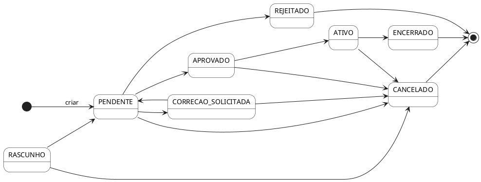

# Máquina de Estados de `ProcessoEstagio`

Uma **máquina de estados finita** descreve um sistema cuja evolução é restrita a um conjunto fechado de situações (estados) e a regras claras de transição entre elas. Em cada momento, a entidade está em exatamente um estado, e só pode passar a outro se a transição estiver explicitamente declarada como válida.

`ProcessoEstagio` é o agregado central da API IBMEC Estágios e precisa de uma máquina de estados porque seu ciclo de vida envolve múltiplos atores (aluno, coordenador, admin), decisões irreversíveis (aprovação, rejeição, encerramento) e regras de negócio que dependem do estado atual. Codificar essas regras em um módulo dedicado evita estados inconsistentes, transições proibidas silenciosas e duplicação de lógica entre views, serializers e admin.

## Por que módulo Python puro

A máquina vive em `djangotutorial/app/state_machine.py` como um módulo **Python puro**: sem `import django`, sem ORM, sem dependência de request. Essa escolha traz três ganhos diretos:

- **Testabilidade isolada:** o módulo pode ser exercitado com `pytest`/`unittest` sem subir banco, sem fixtures, sem `setUp` de modelos. A suíte `StateMachineUnitTest` em `app/tests.py` valida transições em milissegundos.
- **Reusabilidade:** as mesmas constantes e funções são consumidas pela view (`ProcessoEstagioViewSet.alterar_status`), pelos serializers de validação, pelo admin e, no futuro, por jobs assíncronos ou comandos de manage.
- **Separação de concerns:** a regra "pode ir de X para Y?" é uma propriedade do domínio, não da camada web. Mantê-la fora de `views.py` deixa o fluxo HTTP responsável apenas por orquestração e resposta.

As constantes string em `state_machine.py` casam exatamente com `ProcessoEstagio.Status.values` em `app/models.py` — isso é contrato, não coincidência.

## Os 8 estados

| Estado | Descrição | É terminal? |
| --- | --- | --- |
| `RASCUNHO` | "Salvar para depois". Reservado para feature futura; hoje o processo nasce em `PENDENTE` | não |
| `PENDENTE` | Submetido; aguarda análise do coordenador | não |
| `APROVADO` | Coordenador aprovou; aguarda o início efetivo do estágio | não |
| `ATIVO` | Estágio em execução, com documentos formalizados e jornada vigente | não |
| `ENCERRADO` | Estágio concluído após relatório final e validação | sim |
| `REJEITADO` | Coordenador rejeitou; exige justificativa | sim |
| `CORRECAO_SOLICITADA` | Coordenador pediu ajustes; aluno deve reenviar para `PENDENTE` | não |
| `CANCELADO` | Cancelamento por aluno, coordenador ou admin em qualquer ponto do ciclo | sim |

Estados terminais não admitem nenhuma transição de saída — uma vez ali, o processo é histórico. Para o aluno tentar de novo, é necessário **abrir um novo processo**, com novo `pk`. Essa decisão de modelagem preserva a rastreabilidade: cada `ProcessoEstagio` é um registro imutável após chegar a um terminal, e o histórico do aluno é reconstruído pela coleção dos processos passados.

`CANCELADO` aparece como destino possível em **todos** os estados vivos por uma razão de produto: um estágio pode ser interrompido por motivos institucionais a qualquer momento, e cancelar nunca deve estar bloqueado por validação de transição. Já `REJEITADO` e `ENCERRADO` são terminais semanticamente diferentes — o primeiro indica que o estágio nunca aconteceu, o segundo indica que aconteceu e foi finalizado com sucesso.

## Diagrama de transições



A entrada `[*] --> PENDENTE` mostra que, na prática, o processo nasce já submetido. `RASCUNHO` aparece no diagrama por completude da modelagem, mas hoje não é alvo de `perform_create`: a view força `status=PENDENTE` no momento da criação, e a transição `RASCUNHO → PENDENTE` só passa a ser exercitada quando a feature de "salvar para depois" for implementada (issue futura).

Convenções gráficas do diagrama:

- Cada nó corresponde a uma constante string em `state_machine.py`.
- Setas representam transições válidas declaradas em `TRANSICOES`.
- `[*]` no início indica o ponto de criação; `[*]` no final indica que o estado é terminal.

## Tabela "De → Para permitido"

Cópia literal do dicionário `TRANSICOES` em `state_machine.py`. A coluna da esquerda é o estado atual; a da direita, o conjunto de estados alcançáveis.

| De ↓ | Para permitido |
| --- | --- |
| `RASCUNHO` | `PENDENTE`, `CANCELADO` |
| `PENDENTE` | `APROVADO`, `REJEITADO`, `CORRECAO_SOLICITADA`, `CANCELADO` |
| `APROVADO` | `ATIVO`, `CANCELADO` |
| `CORRECAO_SOLICITADA` | `PENDENTE`, `CANCELADO` |
| `ATIVO` | `ENCERRADO`, `CANCELADO` |
| `REJEITADO` | ∅ (terminal) |
| `ENCERRADO` | ∅ (terminal) |
| `CANCELADO` | ∅ (terminal) |

## Comportamento em transição inválida

O endpoint `POST /api/processos-estagio/{id}/alterar_status/` é o único ponto de entrada para mudar `status`. Antes de persistir, a view valida o destino pretendido com `pode_transicionar(processo.status, novo_status)` (na prática, via `transicoes_validas(processo.status)` em `views.py`). Se a transição não estiver no mapa, a resposta é **HTTP 400 Bad Request** com um payload que inclui as alternativas válidas — assim o cliente sabe o que pode fazer a partir do estado atual.

A ordem de validação na view é importante e está documentada no próprio fluxo de `alterar_status`:

1. Campo `status` foi enviado no body? Senão, 400.
2. Transição existe em `TRANSICOES`? Senão, 400 com `transicoes_validas`.
3. O usuário autenticado tem papel autorizado a disparar essa transição? Senão, 403.
4. **RN05 (TCE)** — se a transição for `APROVADO → ATIVO`, existe um `DocumentoProcesso` do tipo `TCE` com `status=APROVADO` para esse processo? Senão, 400 com `{"detail": "RN05: é necessário que o TCE assinado esteja aprovado para ativar o estágio."}`. Veja [Regras de Negócio — RN05](regras-negocio.md#rn05--aprovadoativo-exige-tce-aprovado).
5. O serializer `AlterarStatusSerializer` consegue validar regras de negócio adicionais (por exemplo, justificativa obrigatória em `REJEITADO` — RF11/RN11)? Senão, 400.
6. Persistir, **registrar um `HistoricoStatusProcesso`** (`status_anterior`, `status_novo`, `usuario`, `observacao`) e retornar o processo completo via `ProcessoEstagioSerializer`.

Essa ordem garante que o cliente recebe sempre o erro mais informativo possível: validação estrutural antes da semântica, semântica antes da autorização, autorização antes das regras de negócio do domínio e persistência por último — com trilha de auditoria em `HistoricoStatusProcesso` para reconstruir o ciclo de vida do processo a qualquer momento (`GET /api/processos-estagio/{id}/historico/`).

Exemplo, tentando reativar um processo já rejeitado (`REJEITADO → ATIVO`):

```json
{
  "status": "Transição inválida: REJEITADO → ATIVO.",
  "estado_atual": "REJEITADO",
  "transicoes_validas": []
}
```

Para um caso não-terminal, como tentar `PENDENTE → ATIVO` (faltando passar por `APROVADO`):

```json
{
  "status": "Transição inválida: PENDENTE → ATIVO.",
  "estado_atual": "PENDENTE",
  "transicoes_validas": ["APROVADO", "CANCELADO", "CORRECAO_SOLICITADA", "REJEITADO"]
}
```

O array `transicoes_validas` vem ordenado alfabeticamente para resposta determinística.

## Permissões por papel ao alterar status

A validação da máquina de estados garante que a transição **existe** no domínio. Em seguida, `ProcessoEstagioViewSet.alterar_status` aplica uma camada extra: quem pode disparar cada transição. Essa separação é deliberada — o mapa `TRANSICOES` codifica o que é fisicamente possível no fluxo de negócio; as permissões codificam quem está autorizado a operar essa máquina em cada papel.

| Papel | Transições permitidas |
| --- | --- |
| Aluno (no próprio processo) | `RASCUNHO → PENDENTE`; **cancelamento apenas em `RASCUNHO` ou `PENDENTE`** (`{RASCUNHO, PENDENTE} → CANCELADO`). A partir de `APROVADO`, o aluno **não cancela diretamente** — precisa pedir o cancelamento ao coordenador |
| Coordenador (em processos de alunos dos cursos sob sua coordenação) | `PENDENTE → {APROVADO, REJEITADO, CORRECAO_SOLICITADA}`; `APROVADO → ATIVO` (com RN05); `ATIVO → ENCERRADO`. Pode também emitir `CANCELADO` para retirar processos que já estão em `APROVADO`/`ATIVO`/`CORRECAO_SOLICITADA` (mas o conjunto autorizado é `{APROVADO, REJEITADO, CORRECAO_SOLICITADA, ATIVO, ENCERRADO}` — para cancelamentos em estado vivo, o admin é a rota recomendada) |
| Admin (`is_staff` ou `is_superuser`) | Qualquer transição dentro do mapa `TRANSICOES` |
| Perfis administrativos (`secretaria`, `casa`, `reitor`, `pro_reitor`, `carreiras`) | **Nenhuma**: visão global read-only. A view devolve `403` em qualquer chamada de escrita |
| Supervisor de empresa | Nenhuma ação na máquina de estados |

Violações de propriedade (aluno tentando alterar processo alheio, coordenador atuando em curso fora da sua coordenação) retornam **HTTP 403 Forbidden** com `{"detail": "..."}`. Violações da máquina retornam **HTTP 400**, conforme a seção anterior.

> **Por que o aluno só cancela em `RASCUNHO`/`PENDENTE`?** Antes da aprovação, o aluno pode desistir livremente sem afetar o coordenador ou a empresa. A partir de `APROVADO`, o cancelamento envolve revogação de aprovação, comunicação com a empresa e (em `ATIVO`) interrupção formal do estágio. Para evitar que o aluno acione esses efeitos colaterais sozinho, a regra força o pedido a passar pelo coordenador. O endpoint responde `403 Forbidden` com a mensagem `"Aluno só pode cancelar processos com status RASCUNHO ou PENDENTE."` quando o aluno tenta cancelar fora dessa janela.

## API pública do módulo

Resumo do que `state_machine.py` exporta para o resto do sistema:

- **Constantes (str):** `RASCUNHO`, `PENDENTE`, `APROVADO`, `REJEITADO`, `CORRECAO_SOLICITADA`, `ATIVO`, `ENCERRADO`, `CANCELADO`.
- **Conjuntos imutáveis:** `ESTADOS_TERMINAIS` (`REJEITADO`, `ENCERRADO`, `CANCELADO`), `ESTADOS_VIVOS` (`RASCUNHO`, `PENDENTE`, `APROVADO`, `CORRECAO_SOLICITADA`, `ATIVO`).
- **Dict de transições:** `TRANSICOES: dict[str, set[str]]`.
- **Funções utilitárias:**
  - `transicoes_validas(estado_atual: str) -> set[str]`
  - `pode_transicionar(de: str, para: str) -> bool`
  - `eh_terminal(estado: str) -> bool`

## Snippet do código

```python
# djangotutorial/app/state_machine.py
TRANSICOES: dict[str, set[str]] = {
    RASCUNHO:            {PENDENTE, CANCELADO},
    PENDENTE:            {APROVADO, REJEITADO, CORRECAO_SOLICITADA, CANCELADO},
    APROVADO:            {ATIVO, CANCELADO},
    CORRECAO_SOLICITADA: {PENDENTE, CANCELADO},
    ATIVO:               {ENCERRADO, CANCELADO},
    REJEITADO:           set(),
    ENCERRADO:           set(),
    CANCELADO:           set(),
}

ESTADOS_TERMINAIS = frozenset({REJEITADO, ENCERRADO, CANCELADO})
ESTADOS_VIVOS     = frozenset({RASCUNHO, PENDENTE, APROVADO, CORRECAO_SOLICITADA, ATIVO})


def transicoes_validas(estado_atual: str) -> set[str]:
    """Retorna o conjunto de estados que podem ser alcançados a partir de `estado_atual`."""
    return TRANSICOES.get(estado_atual, set())


def pode_transicionar(de: str, para: str) -> bool:
    """True se a transição `de` → `para` é válida no fluxo do ProcessoEstagio."""
    return para in transicoes_validas(de)


def eh_terminal(estado: str) -> bool:
    """True se `estado` é terminal (REJEITADO, ENCERRADO, CANCELADO)."""
    return estado in ESTADOS_TERMINAIS
```

## Testes que provam

A classe `StateMachineUnitTest` em `djangotutorial/app/tests.py` cobre o módulo com **4 testes unitários puros** — não tocam o banco, não usam `Client` do Django, não criam nenhum modelo. Eles validam, em isolamento:

- Que `TRANSICOES` declara exatamente os estados de saída esperados para cada estado vivo.
- Que `transicoes_validas` retorna conjunto vazio para os três terminais (`REJEITADO`, `ENCERRADO`, `CANCELADO`).
- Que `pode_transicionar` aceita as transições do mapa e rejeita qualquer combinação fora dele.
- Que `eh_terminal` reconhece corretamente o conjunto `ESTADOS_TERMINAIS` e nega para qualquer estado vivo.

Esses testes são a primeira linha de defesa contra regressão silenciosa: se alguém alterar `TRANSICOES` sem atualizar a documentação ou as views, a suíte quebra antes do código chegar ao servidor.

Complementarmente, testes de integração em `ProcessoEstagioApiTest` exercitam a view `alterar_status` ponta a ponta — autenticação por token, validação de permissão por papel, persistência via ORM e formato da resposta — para garantir que o módulo continua se comportando da mesma forma quando consumido por dentro do stack Django/DRF.

## Histórico de status (`HistoricoStatusProcesso`)

Toda transição persistida cria automaticamente um registro em `HistoricoStatusProcesso` com:

- `processo` — FK para o processo;
- `status_anterior` e `status_novo` — strings das constantes de `state_machine.py`;
- `usuario` — quem disparou a transição (FK para `Usuario`);
- `observacao` — texto opcional enviado no body como `observacao`;
- `data` — `auto_now_add`.

Esse registro é a trilha de auditoria do ciclo de vida e é consumido pelo endpoint `GET /api/processos-estagio/{id}/historico/`. A inserção é feita **dentro** do mesmo bloco de `alterar_status` (passo 6 acima), de modo que persistência de status e histórico ficam consistentes mesmo em concorrência.

## Autor(es)

| Data | Versão | Descrição | Autor(es) |
| -- | -- | -- | -- |
| 28/05/2026 | 1.0 | Criação do documento | João Gabriel Teodósio |
| 11/06/2026 | 1.1 | Fluxo de `alterar_status` com 6 passos (RN05 TCE + `HistoricoStatusProcesso`); aluno cancela apenas em `RASCUNHO`/`PENDENTE`; perfis administrativos read-only | João Gabriel Teodósio |
