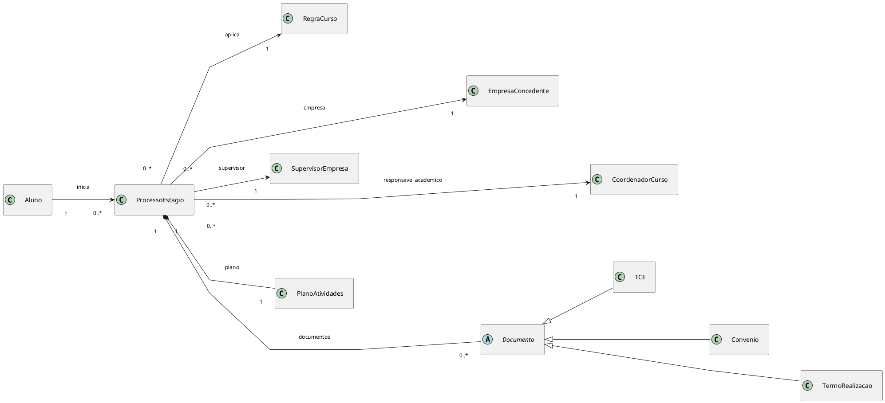
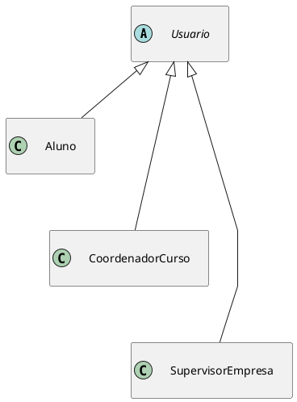
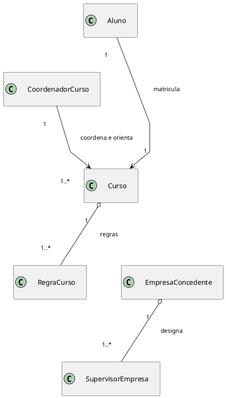
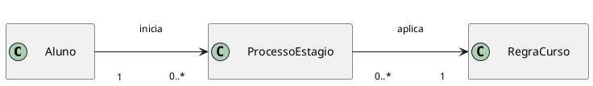
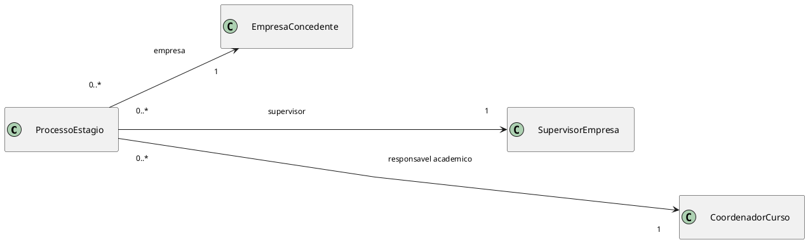
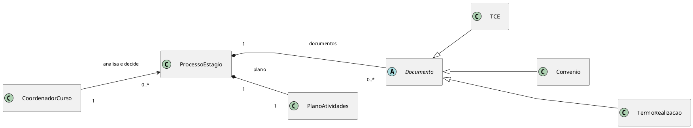
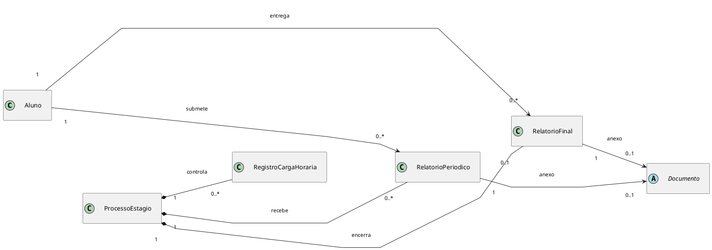
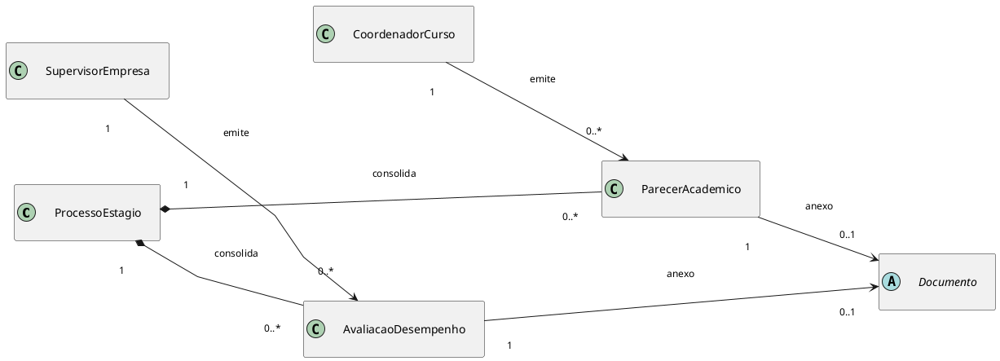
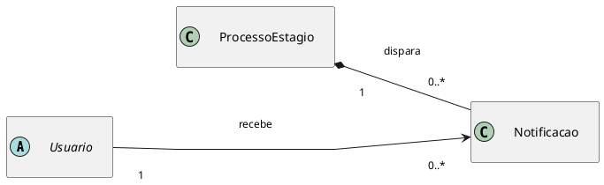

# Diagrama de Classes

## Objetivo

Este documento apresenta o modelo de classes **conceitual** do Sistema de Gestão e Mediação de Estágios Obrigatórios do IBMEC RJ. A modelagem foi derivada da elicitação de requisitos e, nesta fase de elaboração, mostra apenas classes e relacionamentos UML, sem atributos e sem métodos.

> **Observação importante.** Este diagrama é mantido em sua forma conceitual original. A implementação backend (Django + DRF) consolidou parte dessas classes em estruturas mais enxutas — por exemplo, `TCE`, `Convenio`, `TermoRealizacao`, `RelatorioPeriodico` e `RelatorioFinal` virariam todos instâncias de um único modelo `DocumentoProcesso` parametrizado por um campo `tipo`; `PlanoAtividades` virou um campo do `ProcessoEstagio`; `AvaliacaoDesempenho` e `ParecerAcademico` foram absorvidos pelo modelo `AvaliacaoEmpresa` combinado com o JSON `respostas_formulario` do processo. A tabela abaixo registra essa correspondência entre a classe conceitual e onde ela vive de fato no código.

### Mapeamento "classe conceitual → onde vive na implementação"

| Classe conceitual | Onde vive na implementação |
| --- | --- |
| `Usuario` (abstrata) | Concreta em `app.models.Usuario` (estende `AbstractUser`, `USERNAME_FIELD='email_institucional'`) |
| `Aluno` | `app.models.Aluno` (1:1 com `Usuario`, FK para `Curso`) |
| `CoordenadorCurso` | `app.models.Coordenador` (1:1 com `Usuario`); `Curso.coordenador` é FK com `related_name='cursos'` (1:N) |
| `SupervisorEmpresa` | `app.models.SupervisorEmpresa` (1:1 com `Usuario`, FK para `EmpresaConcedente`) |
| `EmpresaConcedente` | `app.models.EmpresaConcedente` |
| `Curso` | `app.models.Curso` |
| `RegraCurso` | Sem tabela própria — virou atributos diretos de `Curso` (`carga_horaria_minima_total`, `carga_horaria_maxima_diaria`) e validações dentro de `CriarProcessoSerializer.validate` |
| `ProcessoEstagio` | `app.models.ProcessoEstagio` (agregado central, com `status` controlado por `state_machine.py`) |
| `PlanoAtividades` | Campo `ProcessoEstagio.plano_atividades` (TextField), não é tabela separada |
| `Documento` (abstrata) | `app.models.DocumentoProcesso` (concreta, com campo `tipo` para distinguir variantes) |
| `TCE` | `DocumentoProcesso` com `tipo='TCE'` |
| `Convenio` | Não modelado como tipo distinto na implementação — entra como `DocumentoProcesso` com `tipo='OUTRO'` quando necessário |
| `TermoRealizacao` | `DocumentoProcesso` com `tipo='TERMO_REALIZACAO'`; PDF gerado em `GET /api/processos-estagio/{id}/gerar-termo-realizacao/` (reportlab) |
| `RegistroCargaHoraria` | Não modelado como tabela — controle é derivado de `ProcessoEstagio.horas_semanais` + `data_inicio_prevista`/`data_fim_prevista` (estimativa em `dashboard_utils`) |
| `RelatorioPeriodico` | `DocumentoProcesso` com `tipo='RELATORIO_PARCIAL'`; gerado pelo endpoint `POST /api/processos-estagio/{id}/gerar-relatorio/` (campo `tipo_relatorio='parcial'`) |
| `RelatorioFinal` | `DocumentoProcesso` com `tipo='RELATORIO_FINAL'` (mesmo endpoint, `tipo_relatorio='final'`) |
| `AvaliacaoDesempenho` (do supervisor) | Implementada como **resposta do aluno** ao `ModeloFormulario` do curso, armazenada em `ProcessoEstagio.respostas_formulario` (JSONField), e materializada como `DocumentoProcesso` (`RELATORIO_PARCIAL`/`RELATORIO_FINAL`) pelo `POST /api/processos-estagio/{id}/preencher-formulario/`. A inversão é deliberada: o **aluno** preenche o formulário avaliativo no IBMEC, não o supervisor |
| `ParecerAcademico` (do coordenador) | Sem tabela própria — a decisão do coordenador vira `status` do `ProcessoEstagio` + `HistoricoStatusProcesso` (com `observacao`), e a justificativa (em rejeição) vai em `ProcessoEstagio.justificativa_rejeicao` |
| `Notificacao` | Sem tabela própria — notificações são entregues por **email** (`send_mail`) nos pontos de transição relevantes (definição de senha do supervisor após cadastro de empresa por aluno, link de redefinição de senha). Jobs assíncronos/Celery ficam fora do escopo |
| — *(novo na implementação)* | `app.models.AvaliacaoEmpresa` — avaliação do **aluno sobre a empresa**, em duas modalidades: **vinculada** (com FK para `aluno` e `processo`) e **anônima** (`aluno=None`, `processo=None`, identidade preservada via `aluno_hash` SHA-256) |
| — *(novo na implementação)* | `app.models.LogDocumento` — trilha de auditoria por documento (upload, aprovado, rejeitado, gerado) |
| — *(novo na implementação)* | `app.models.HistoricoStatusProcesso` — trilha de transições do processo (status anterior, status novo, usuário, observação) |
| — *(novo na implementação)* | `app.models.ModeloFormulario` — schema JSON do formulário avaliativo por curso, com seções dinâmicas (`escala_1_4`, `escala_1_4_multi`, `escala_3`, `checkbox_duplo`, etc.) |
| — *(novo na implementação)* | `app.models.TemplateDocumento` — modelo de TCE/Termo por curso |

Quem está implementando uma feature deve consultar **primeiro** os modelos reais em `app/models.py` e os ViewSets em `app/views.py`. Este diagrama serve para entender a intenção semântica de cada conceito e a estrutura do domínio do estágio obrigatório, mas não substitui o código como fonte de verdade.

## Premissas de modelagem

- O recorte considera somente o fluxo de estágio obrigatório.
- As classes foram organizadas em três blocos para manter legibilidade: identidade e atores, núcleo do processo e acompanhamento/governança.
- Estados, histórico de status, permissões detalhadas e campos internos não aparecem como classes neste momento.
- Um `Aluno` pode acumular vários `ProcessoEstagio` no histórico, mas mantém apenas um processo ativo por vez. Um novo processo só pode ser iniciado se o anterior tiver sido cancelado.
- `Usuario` foi mantida como classe abstrata para representar dados e comportamentos comuns de autenticação, identificação e rastreabilidade.
- `Perfil` não foi mantida como classe neste recorte conceitual. As permissões continuam existindo, mas são tratadas como regras associadas ao tipo de usuário.
- `CoordenadorCurso` representa o responsável acadêmico pelo estágio. No contexto do IBMEC, essa classe também cobre a função de orientação que antes poderia ser atribuída a um professor orientador separado.
- Secretaria e demais apoios administrativos não foram modelados como classes centrais nesta versão; se necessário, podem ser tratados futuramente como permissões operacionais de usuário.
- TCE, convênio, termo de realização e demais artefatos legais passam a ser representados como especializações concretas de `Documento`, removendo a necessidade de uma classe classificadora separada.
- `Documento` passa a ser uma classe abstrata. Ela concentra o comportamento comum do registro documental, enquanto as subclasses concretas representam os tipos de anexo relevantes do processo.

## Visão geral das classes propostas

| Bloco | Classes |
| --- | --- |
| Identidade e atores | `Usuario`, `Aluno`, `CoordenadorCurso`, `SupervisorEmpresa`, `EmpresaConcedente`, `Curso`, `RegraCurso` |
| Núcleo do processo | `ProcessoEstagio`, `PlanoAtividades`, `Documento`, `TCE`, `Convenio`, `TermoRealizacao` |
| Acompanhamento e governança | `RegistroCargaHoraria`, `RelatorioPeriodico`, `RelatorioFinal`, `AvaliacaoDesempenho`, `ParecerAcademico`, `Notificacao` |

## Papel das classes no modelo

As classes do diagrama foram escolhidas para representar conceitos persistentes do domínio, isto é, informações que precisam ser consultadas, validadas ou acompanhadas ao longo do processo de estágio. Por isso, o modelo inclui não apenas atores, mas também registros formais do ciclo de vida do processo.

| Classe | Papel no domínio |
| --- | --- |
| `Usuario` | Classe abstrata para representar qualquer pessoa autenticável no sistema. Serve como base para aluno, coordenador e supervisor. |
| `Aluno` | Usuário que abre o processo de estágio, envia documentos, acompanha solicitações de correção e entrega relatórios. |
| `CoordenadorCurso` | Usuário responsável pela validação acadêmica do estágio. No contexto do IBMEC, acumula a função de coordenação e orientação acadêmica. |
| `SupervisorEmpresa` | Usuário vinculado à empresa concedente, responsável pelo acompanhamento do aluno no ambiente de estágio. |
| `EmpresaConcedente` | Organização onde o estágio será realizado. Uma mesma empresa pode estar ligada a vários processos. |
| `Curso` | Curso do aluno, usado para contextualizar regras acadêmicas e responsabilidade do coordenador. |
| `RegraCurso` | Conjunto de regras acadêmicas aplicáveis ao estágio, como carga horária, documentos obrigatórios e critérios de validação. |
| `ProcessoEstagio` | Classe central do modelo. Representa a solicitação e todo o ciclo de vida do estágio obrigatório. Um aluno pode ter vários processos no histórico, mas apenas um ativo por vez. |
| `PlanoAtividades` | Registro das atividades previstas para o estágio. Foi modelado como classe porque precisa ser validado academicamente e permanecer vinculado ao processo durante a análise e a execução. |
| `Documento` | Classe abstrata que representa qualquer artefato documental persistido no processo. Centraliza o conceito de anexo, termo ou comprovante associado ao estágio. |
| `TCE` | Especialização de `Documento` para o Termo de Compromisso de Estágio. |
| `Convenio` | Especialização de `Documento` para o convênio ou instrumento institucional equivalente da concedente. |
| `TermoRealizacao` | Especialização de `Documento` para o documento de formalização ou comprovação de realização do estágio. |
| `RegistroCargaHoraria` | Controle das horas realizadas e validadas durante o estágio. |
| `RelatorioPeriodico` | Registro de entrega parcial feita durante o acompanhamento do estágio. Pode estar associado a um `Documento` anexado. |
| `RelatorioFinal` | Registro de encerramento entregue ao final do estágio. Pode estar associado a um `Documento` anexado. |
| `AvaliacaoDesempenho` | Registro da avaliação emitida pelo supervisor da empresa sobre a atuação do aluno. Pode estar associado a um `Documento` anexado. |
| `ParecerAcademico` | Registro do parecer emitido pelo coordenador sobre a aderência acadêmica do estágio. Pode estar associado a um `Documento` anexado. |
| `Notificacao` | Comunicação enviada aos usuários sobre mudanças, decisões, solicitações de correção ou prazos. |

## Fluxo conceitual representado

O modelo parte da solicitação aberta pelo `Aluno` e organiza o restante do fluxo em torno de `ProcessoEstagio`. O processo aplica uma `RegraCurso`, recebe documentos, vincula a empresa concedente, registra o supervisor da empresa e atribui um `CoordenadorCurso` como responsável acadêmico. A multiplicidade entre `Aluno` e `ProcessoEstagio` representa o histórico de solicitações; por regra de negócio, o aluno mantém apenas um processo ativo por vez e só pode abrir outro depois do cancelamento do anterior.

Durante a análise, o `CoordenadorCurso` valida a compatibilidade do estágio com o curso, decide diretamente sobre o avanço do processo e produz pareceres acadêmicos quando necessário. O `SupervisorEmpresa` permanece responsável pelo acompanhamento do aluno dentro da concedente e pela avaliação de desempenho. Ao longo do ciclo, o sistema registra documentos, relatórios, carga horária e notificações. Histórico detalhado de status e rastreabilidade continuam previstos como comportamento do sistema, mas não aparecem como classes próprias neste recorte.

A visão geral abaixo apresenta esse núcleo em uma única leitura, com foco apenas nas relações essenciais do processo. Depois dela, o documento detalha os mesmos vínculos em recortes menores para preservar legibilidade. No fluxo documental, `Documento` funciona como raiz abstrata da hierarquia de peças documentais do processo. `TCE`, `Convenio` e `TermoRealizacao` aparecem como especializações explícitas no diagrama, deixando o tipo do artefato declarado pela própria classe concreta. Já `RelatorioPeriodico`, `RelatorioFinal`, `AvaliacaoDesempenho` e `ParecerAcademico` não são subclasses de `Documento`: eles representam entregas ou decisões do processo e apenas podem apontar para um anexo documental quando houver arquivo associado.

## Visão Geral Integrada do Processo

Esta visão reúne, em um único recorte, apenas as classes centrais do estágio obrigatório. Ela existe para dar contexto rápido ao leitor antes dos diagramas fragmentados e não substitui os detalhes apresentados nas visões seguintes.

### Leitura da visão geral

- `ProcessoEstagio` é o agregado central do domínio e organiza a abertura, a formalização e a validação do estágio obrigatório.
- O `Aluno` abre o processo, enquanto `EmpresaConcedente`, `SupervisorEmpresa` e `CoordenadorCurso` representam os vínculos institucionais necessários para sua análise e acompanhamento.
- A cardinalidade `0..*` entre `Aluno` e `ProcessoEstagio` representa histórico; no domínio, apenas um processo pode ficar ativo por vez para o mesmo aluno.
- `RegraCurso` contextualiza as exigências acadêmicas aplicadas ao processo.
- `PlanoAtividades` e `Documento` aparecem dentro do processo porque são partes formais da solicitação e da validação.
- A hierarquia documental foi mantida enxuta: `TCE`, `Convenio` e `TermoRealizacao` aparecem como especializações concretas apenas para os artefatos essenciais já consolidados no modelo.

## Visão 1. Identidade, atores e contexto acadêmico

Para reduzir cruzamentos, padronizar a escala visual e evitar rótulos sobre linhas, a visão de identidade foi dividida em recortes menores com layout mais controlado.

### Visão 1A. Hierarquia de usuários

### Visão 1B. Contexto acadêmico e institucional

### Leitura da visão 1

- `Aluno`, `CoordenadorCurso` e `SupervisorEmpresa` continuam como especializações de `Usuario`, mas aparecem isolados do contexto acadêmico para facilitar leitura.
- A Visão 1A mostra apenas a hierarquia de usuários autenticáveis, enquanto a Visão 1B mostra o contexto acadêmico e institucional em que esses atores atuam.
- `Usuario` concentra a noção comum de conta autenticável. Permissões específicas não aparecem como classe própria, pois são regras derivadas do tipo de usuário.
- `CoordenadorCurso` acumula a coordenação do curso e a responsabilidade de orientação acadêmica do estágio, conforme a regra institucional assumida para o IBMEC.
- `EmpresaConcedente` foi separada da hierarquia de usuários porque é uma organização do domínio, não uma conta base do sistema.
- `Curso` e `RegraCurso` ficaram em um diagrama próprio para evidenciar as regras acadêmicas sem poluir a visão de autenticação.
- Na Visão 1B, `RegraCurso` aparece ligada a `Curso` para mostrar de onde vêm as exigências acadêmicas. Na Visão 2A, essa mesma regra aparece ligada a `ProcessoEstagio` para mostrar onde ela é aplicada no caso concreto do aluno.

## Visão 2. Núcleo do processo de estágio

O núcleo do processo foi reorganizado em recortes mais curtos para manter a mesma legibilidade visual entre os blocos e reduzir desvio das setas.

### Visão 2A. Abertura do processo e regra acadêmica

### Visão 2B. Vínculos institucionais do processo

### Visão 2C. Estrutura documental e decisão acadêmica do processo

Este recorte reúne os elementos que formalizam a solicitação e a análise do coordenador. O `PlanoAtividades` representa o planejamento acadêmico do estágio: atividades previstas, relação com o curso e base para a validação acadêmica. Ele aparece como classe própria porque não é apenas um arquivo anexado; é uma parte estruturante do processo e pode ser analisado e corrigido ao longo do fluxo. Já `Documento` representa somente a peça documental vinculada ao processo, e por isso aparece como classe abstrata com subclasses concretas para os principais artefatos legais. A decisão do coordenador incide diretamente sobre `ProcessoEstagio`, sem a necessidade de classes intermediárias de aprovação, pendência, aditivo, rescisão ou histórico de status.

### Leitura da visão 2

- A Visão 2 foi dividida em três recortes para preservar legibilidade, mas todos eles descrevem o mesmo agregado principal: `ProcessoEstagio`.
- Na Visão 2A, o `Aluno` inicia o `ProcessoEstagio`, e o processo aplica uma `RegraCurso`.
- Na Visão 2A, a multiplicidade `0..*` representa o histórico de solicitações do aluno, não múltiplos processos ativos simultâneos.
- Na Visão 2B, o `ProcessoEstagio` fica vinculado à `EmpresaConcedente`, ao `SupervisorEmpresa` e ao `CoordenadorCurso` responsável acadêmico.
- Na Visão 2C, cada `ProcessoEstagio` compõe um `PlanoAtividades` e zero ou muitos `Documento`, enquanto o `CoordenadorCurso` analisa e decide sobre o avanço do processo.
- A hierarquia de `Documento` foi mantida restrita aos artefatos documentais do processo. Por isso, `TCE`, `Convenio` e `TermoRealizacao` aparecem como subclasses concretas.
- A etapa de análise foi simplificada: `CoordenadorCurso` decide diretamente sobre `ProcessoEstagio`, sem exigir classes separadas de aprovação, pendência, aditivo, rescisão ou histórico de status.

## Visão 3. Acompanhamento, avaliações e notificações

O acompanhamento posterior à análise inicial também foi padronizado para manter escala semelhante entre os blocos e evitar diferenças excessivas de tamanho visual. Nesta visão, relatórios, avaliações, pareceres e notificações aparecem como registros próprios do processo. O vínculo opcional com `Documento` indica apenas a existência de um arquivo anexado, e não uma relação de herança documental.

### Visão 3A. Registro de horas e entregas do aluno

### Visão 3B. Avaliações e pareceres

### Visão 3C. Notificações do processo

### Leitura da visão 3

- `RegistroCargaHoraria`, `RelatorioPeriodico` e `RelatorioFinal` aparecem juntos porque representam o acompanhamento operacional do aluno dentro do `ProcessoEstagio`.
- Em 3A, cada `ProcessoEstagio` pode encerrar com no máximo um `RelatorioFinal`, mas o `Aluno` pode acumular vários relatórios finais ao longo do histórico de processos.
- `AvaliacaoDesempenho` e `ParecerAcademico` ficaram em um recorte separado para destacar os emissores distintos: a avaliação operacional vem do `SupervisorEmpresa`, enquanto o parecer acadêmico vem do `CoordenadorCurso`.
- `RelatorioPeriodico`, `RelatorioFinal`, `AvaliacaoDesempenho` e `ParecerAcademico` podem ter anexos, mas não herdam de `Documento`. Cada uma dessas classes continua existindo como registro do processo mesmo sem arquivo; `Documento` modela apenas o artefato documental eventualmente anexado.
- Nos recortes 3A e 3B, a seta `--> Documento : anexo` indica associação opcional a um arquivo, e não especialização.
- A hierarquia documental continua restrita às subclasses concretas mostradas na Visão 2C, como `TCE`, `Convenio` e `TermoRealizacao`.
- `Notificacao` ganhou um recorte independente para representar a comunicação do processo sem poluir as relações de acompanhamento.
- Histórico detalhado de status e rastreabilidade continuam tratados como comportamento sistêmico, sem a necessidade de uma classe própria neste recorte conceitual.

## Decisões de modelagem que ainda dependem de validação

- Validar se `SupervisorEmpresa` é o único representante autenticado da empresa ou se haverá um papel adicional para cadastro institucional.
- Confirmar se outras peças documentais além de `TCE`, `Convenio` e `TermoRealizacao` já precisam aparecer como subclasses explícitas de `Documento`.
- Decidir se `TermoCooperacao` deve entrar desde já como especialização documental própria ou se pode continuar absorvido por `Convenio` nesta fase conceitual.
- Verificar se `RegistroCargaHoraria` será um lançamento manual recorrente ou uma consolidação derivada de relatórios.
- Confirmar se, em versões futuras, secretaria e apoio administrativo precisarão de classes próprias ou se continuarão como permissões operacionais associadas a `Usuario`.

## Síntese

O modelo proposto posiciona `ProcessoEstagio` como centro do domínio e distribui o restante das classes entre três preocupações principais: identidade dos atores, formalização do processo e acompanhamento do estágio com avaliações e notificações. O `CoordenadorCurso` passa a ser o responsável acadêmico único dentro do IBMEC, acumulando a validação antes associada ao professor orientador, enquanto a etapa de decisão foi simplificada pela remoção de classes intermediárias como aprovação, pendência, aditivo, rescisão, histórico de status e log de auditoria. O modelo também deixa explícito que o aluno pode acumular vários processos no histórico, mas só mantém um ativo por vez. A estrutura documental foi refinada: `Documento` passou a ser abstrata, e os principais tipos de anexo agora aparecem como especializações explícitas no diagrama. Esse recorte é suficiente para orientar a próxima etapa de detalhamento do back-end sem antecipar atributos, métodos ou decisões de persistência que ainda dependem de validação com o cliente.

## Autor(es)
| Data | Versão | Descrição | Autor(es) |
| -- | -- | -- | -- |
| 11/04/2026 | 1.0 | Criação do documento | João Gabriel |
| 15/04/2026 | 2.0 | Atualização do documento consertando as cardialidades das classes e removendo classes desnecessárias | João Gabriel |
| 16/04/2026 | 2.1 | Documento abstrato com subclasses documentais e simplificação da visão 2D | João Gabriel |
| 16/04/2026 | 2.2 | Mesclagem das visões 2C e 2D com remoção de classes de apoio ao fluxo | João Gabriel |
| 16/04/2026 | 2.3 | Adição de visão geral integrada do processo com manutenção dos recortes detalhados | João Gabriel |
| 16/04/2026 | 2.4 | Ajuste da regra de processo ativo por aluno e remoção de LogAuditoria | João Gabriel |
| 11/06/2026 | 2.5 | Adicionada nota e tabela de mapeamento "classe conceitual → implementação" para refletir a consolidação feita no backend (DocumentoProcesso unificado, PlanoAtividades como campo, AvaliacaoEmpresa, HistoricoStatusProcesso, LogDocumento, ModeloFormulario, TemplateDocumento) | João Gabriel Teodósio |
